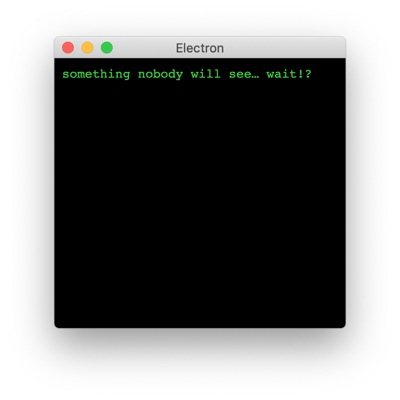

# The Electron Survival Guide


## Motivation

You probably read in many places that `nodeIntegration` set to `true` is both bad practice and dangerous. You also probably tried turning it off only to see your Electron app hopelessly broken.

Don't give up just yet. There is light at the end of the tunnel. I saw it once.
## Bad practice 101

Sometimes it helps to know what **not to do**. Unfortunately this is something you've probably seen a lot.

app01/answer.js
``` javascript
module.exports = () => `
 ▄         ▄  ▄▄▄▄▄▄▄▄▄▄▄
▐░▌       ▐░▌▐░░░░░░░░░░░▌
▐░▌       ▐░▌ ▀▀▀▀▀▀▀▀▀█░▌
▐░▌       ▐░▌          ▐░▌
▐░█▄▄▄▄▄▄▄█░▌          ▐░▌
▐░░░░░░░░░░░▌ ▄▄▄▄▄▄▄▄▄█░▌
 ▀▀▀▀▀▀▀▀▀█░▌▐░░░░░░░░░░░▌
          ▐░▌▐░█▀▀▀▀▀▀▀▀▀
          ▐░▌▐░█▄▄▄▄▄▄▄▄▄
          ▐░▌▐░░░░░░░░░░░▌
           ▀  ▀▀▀▀▀▀▀▀▀▀▀
`;
```
app01/main.js
``` javascript
const {app, BrowserWindow} = require('electron');

app.whenReady().then(async () => {
  const bwin = new BrowserWindow({
    width: 300,
    height: 300,
    webPreferences: {
      nodeIntegration: true,  // <- Don't do this!
      contextIsolation: false // <- Don't do this!
    }
  });
  await bwin.loadFile('renderer.html');
  bwin.show();
});
```
app01/renderer.html
``` html
<html>
  <head>
    <style>
      body {background-color:black;color:limegreen}
    </style>
  </head>
  <body>
    <pre></pre>
    <script src="./renderer.js"></script>
  </body>
</html>
```
app01/renderer.js
``` javascript
const answer = require('./answer');
document.querySelector('pre').innerHTML = answer();
```

