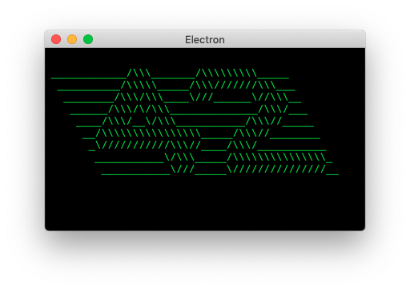

## Bundling your renderer script

We can use Webpack to package the renderer script (and its dependencies) into a bundle that works in a browser and therefore don't need to turn on `nodeIntegration` to enable Node.js `require`.

We _could_ have disabled `contextIsolation` so that the bundle could have access to the HTML document but instead we chose to expose a function which doesn't need to be context aware. The document that imports it will be its execution context and so we can see the result.

app02/answer.js
``` javascript
module.exports = () => String.raw`
____________/\\\_______/\\\\\\\\\_____
 __________/\\\\\_____/\\\///////\\\___
  ________/\\\/\\\____\///______\//\\\__
   ______/\\\/\/\\\______________/\\\/___
    ____/\\\/__\/\\\___________/\\\//_____
     __/\\\\\\\\\\\\\\\\_____/\\\//________
      _\///////////\\\//____/\\\/___________
       ___________\/\\\_____/\\\\\\\\\\\\\\\_
        ___________\///_____\///////////////__
`;

```
app02/main.js
``` javascript
const {app, BrowserWindow} = require('electron');

app.whenReady().then(async () => {
  const bwin = new BrowserWindow({
    width: 400,
    height: 250,
    webPreferences: {
      nodeIntegration: false, // <- Good!
      contextIsolation: true  // <- Nice!
    }
  });
  await bwin.loadFile('renderer.html');
  bwin.show();
});

```
app02/renderer.bundle.js
``` javascript
(()=>{var _={663:_=>{_.exports=()=>String.raw`
____________/\\\_______/\\\\\\\\\_____
 __________/\\\\\_____/\\\///////\\\___
  ________/\\\/\\\____\///______\//\\\__
   ______/\\\/\/\\\______________/\\\/___
    ____/\\\/__\/\\\___________/\\\//_____
     __/\\\\\\\\\\\\\\\\_____/\\\//________
      _\///////////\\\//____/\\\/___________
       ___________\/\\\_____/\\\\\\\\\\\\\\\_
        ___________\///_____\///////////////__
`},457:(_,r,e)=>{const t=e(663);_.exports=_=>{document.querySelector(_).innerHTML=t()}}},r={},e=function e(t){var o=r[t];if(void 0!==o)return o.exports;var n=r[t]={exports:{}};return _[t](n,n.exports,e),n.exports}(457);window.app02=e})();
```
app02/renderer.html
``` html
<html>
  <head>
    <style>
      body {background-color:black;color:limegreen}
    </style>
  </head>
  <body>
    <pre></pre>
    <script src="./renderer.bundle.js"></script>
    <script>
      window.app02('pre');
    </script>
  </body>
</html>

```
app02/renderer.js
``` javascript
const answer = require('./answer');

module.exports = sel => {
  document.querySelector(sel).innerHTML = answer();
};

```
app02/webpack.config.js
``` javascript
module.exports = {
  mode: 'production',
  context: __dirname,
  entry: {
    renderer: './renderer.js'
  },
  output: {
    path: __dirname,
    filename: '[name].bundle.js',
    library: {
      type: 'window',
      name: 'app02'
    }
  }
};

```



